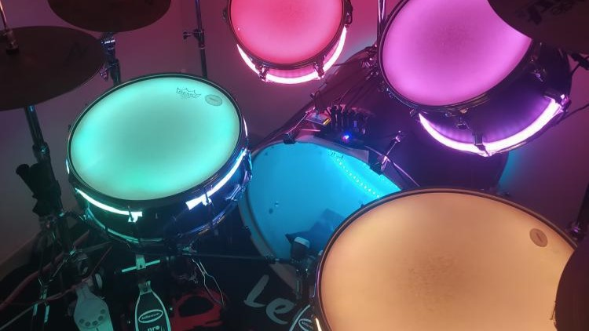

#  Tunes (DrumsLed) Embedded Application

DrumsLed is an embedded application that allows you to control LED lights on a drum set. The primary purpose of this app is to detect when a drum is struck and illuminate LEDs accordingly. The communication between the mobile app and the drum set is established via Bluetooth Low Energy (BLE). The drum set, equipped with ESP32 and piezo sensors, detects drum strikes, and the mobile app controls LED animations and colors.

## Mobile Application

The DrumsLed Mobile App, which complements this embedded application, can be found in a separate GitHub repository: [DrumsLed Mobile App](https://github.com/maxsans/DrumsLed-Mobile-App).

Please refer to the [DrumsLed Mobile App repository](https://github.com/maxsans/DrumsLed-Mobile-App) for details regarding the mobile app interface and features.

## Embedded Application Features

The DrumsLed embedded application consists of several key components:

### 1. Drum Strike Detection

- Utilizes piezo sensors to detect drum strikes.
- Processes sensor data to determine the intensity and timing of strikes.

### 2. LED Control

- Controls LED animations and colors based on drum strikes.
- Supports multiple LED configurations for different drums.

### 3. Bluetooth Low Energy (BLE) Communication

- Establishes a BLE connection with the mobile app.
- Transmits drum strike data and receives LED control commands.

## Data Format

Data between the embedded application and the mobile app is exchanged in JSON format. Below is an example of the data structure:

```json
{
  "drum": "Caisse Claire",
  "strikeIntensity": 75,
  "ledConfig": {
    "interior": {
      "colors": ["#FFFFFF", "#ff26e5"],
      "animation": 6
    },
    "exterior": {
      "colors": ["#022a7a"],
      "animation": 6
    }
  }
}
```

## LED Animations and Color Settings

| Animation           | Value | Max Colors |
|---------------------|-------|------------|
| Lumière             | 1     | 1          |
| Lent                | 2     | 1          |
| Normal              | 3     | 1          |
| Rapide              | 4     | 1          |
| Disco               | 5     | 10         |
| Rotation            | 6     | 4          |

At startup, the default LED color for all drums is white, and the default animation is "Lumière."

# Overview




## Future Developments

We are currently developing a new ecosystem to enhance your experience. This includes:

- A new cross-platform application
- An improved design
- A new transmission protocol
- An updated version of the embedded software

Stay tuned for these exciting updates!
