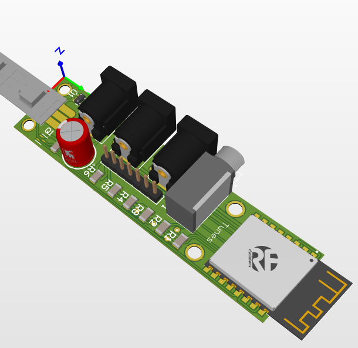
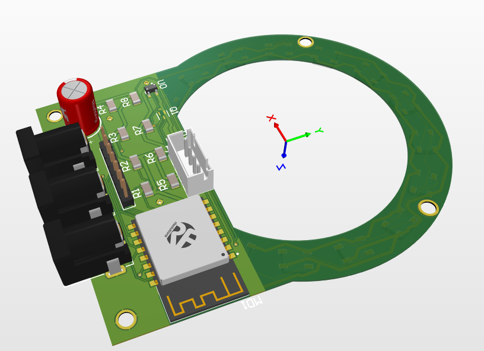
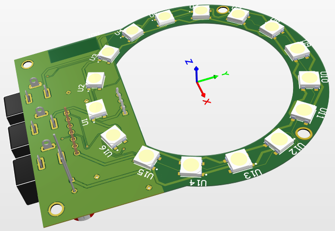
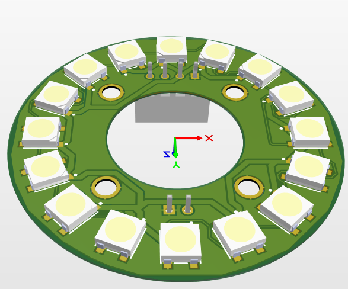

# Slave Project

## Description
The project is materially composed of a master module and slave modules. See README.md of the master project for more information.
The slave modules are embedded on musical instruments. They perform very few calculations and are mainly interfaces between the external environment and the master module.

## Temporary version
The current version of the slave project is temporary: it needs to be redone but it currently serves as a prototype for the master project.
This is why the Arduino framework was used (for its rapid development).

There is currently 1 slave project for several different targets. This is clearly not ideal as the targets have different needs..

## Communication
Communication between the master module and the slave modules is done via a Wi-Fi connection. The protocol used for real-time exchanges is the UDP protocol.

## Hardware

### Drum module

### Bottom cymbal module

### Top cymbal module
